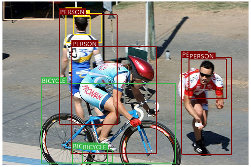
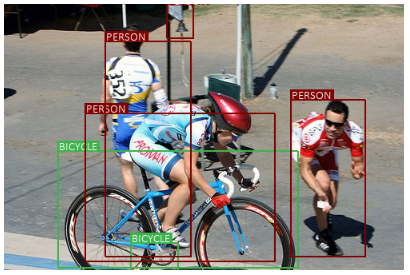

# SSD: Single Shot multibox Detector - Pytorch
Repository: [https://github.com/sgrvinod/a-PyTorch-Tutorial-to-Object-Detection](https://github.com/sgrvinod/a-PyTorch-Tutorial-to-Object-Detection) <br/>
You can run object detection in video using webcam
## Paper
[SSD: Single Shot MultiBox Detector ECCV 2016](https://arxiv.org/abs/1512.02325)<br/>
Wei Liu<sup> 1</sup>, Dragomir Anguelov<sup> 2</sup>, Dumitru Erhan<sup> 3</sup>, Christian Szegedy<sup> 3</sup>, Scott Reed<sup> 4</sup>,<br/>Cheng-Yang Fu<sup> 1</sup>, Alexander C. Berg<sup> 1</sup> <br/>
<sup>1 </sup>UNC Chapel Hill, <sup>2 </sup>Zoox Inc., <sup>3 </sup>Google Inc., <sup> 4 </sup>University of Michigan, Ann-Arbor

## Dependencies
* [Python 3.6]
* [PyTorch 1.1.0]

## Usage

### 1. Cloning the repository

```bash
$ git clone https://github.com/jinyoungHan/pytorch-ssd.git
$ cd pytorch-ssd/
```

### 2. Dataset

[VOC2012 test](http://host.robots.ox.ac.uk/pascal/VOC/voc2012/VOCtrainval_11-May-2012.tar) <br/>
[VOC2007 train](http://host.robots.ox.ac.uk/pascal/VOC/voc2007/VOCtrainval_06-Nov-2007.tar) <br/>
[VOC2007 test](http://host.robots.ox.ac.uk/pascal/VOC/voc2007/VOCtest_06-Nov-2007.tar) <br/>

Extract both the VOC 2007 trainval and 2007 test data to the same location <br/>
data/VOC2007/train <br/>
data/VOC2007/test <br/>

After downloading datasets
```bash
$ python data2json.py
```

### 3. Training
On a GTX 1060, each epoch of training required about 30 minutes.

```bash
$ python train.py
```

### 4. Test

```bash
i: image , image path or no image path(default path)
w: webcam, no image path

$ python detect.py <i or w> <image path>
```

## Results

#### 1. Epoch 5 - Loss 3.865
<p></p>

#### 2. Epoch 10 - Loss 3.282
<p></p>

#### 3. Epoch 25 - Loss 2.972
<p></p>
